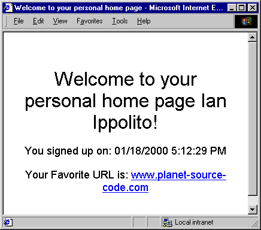



## Create customized web output using VB web classes

### Description

You CAN create web apps without losing the sophistication of such Visual Basic niceties as sophisticated error handling, API calls, class modules, etc...using Visual Basic Web Classes! This article shows you how.
 
### More Info
 

             |
---                |---
**Submitted On**   |1999-11-07 12:30:00
**By**             |[Ian Ippolito \(vWorker\)](https://github.com/Planet-Source-Code/PSCIndex/blob/master/ByAuthor/ian-ippolito-vworker.md)
**Level**          |Intermediate
**User Rating**    |4.6 (37 globes from 8 users)
**Compatibility**  |VB 5\.0, VB 6\.0
**Category**       |[Internet/ HTML](https://github.com/Planet-Source-Code/PSCIndex/blob/master/ByCategory/internet-html__1-34.md)
**World**          |[Visual Basic](https://github.com/Planet-Source-Code/PSCIndex/blob/master/ByWorld/visual-basic.md)
**Archive File**   |[CODE\_UPLOAD50544212000\.zip](https://github.com/Planet-Source-Code/ian-ippolito-vworker-create-customized-web-output-using-vb-web-classes__1-7473/archive/master.zip)

### Source Code

From <a href="http://www.zdjournals.com/asp">Active
Server Developer Magazine</a>, March 2000 
Reposted with Permission of <a href="http://www.zdjournals.com/">ZD
Net Journals</a> 
 
As you probably know, Visual Basic contains many useful features that
VBScript lacks, like sophisticated error trapping, class modules, API calls, and
user-defined types. If you've come to ASP programming from Visual Basic, then
you probably found yourself yearning for something as simple as runtime
debugging. Sure, Microsoft InterDev provides debugging, but let's face it, it
can't hold a candle to Visual Basic's IDE. If you're like us, you probably
wished for a way to have your cake and eat it too--that is, to program ASP pages
with the full power of Visual Basic directly from Visual Basic's IDE. In that
case, you'll be happy to know that Visual Basic 6.0 gives you the ability to do
just that. The WebClass object and Designer lets you create COM DLL's that act
exactly like regular ASP pages.

In this article, we'll take you step by step through the process of building
a WebClass. When we've finished, we'll have a simple Web portal that will let
you register a name and password with the site, and then display a customized
home page based on the initial information.
<H3>What's in a WebClass?</H3>As we mentioned, a WebClass is a COM DLL that
serves as a type of proxy on your Web server, serving out the appropriate HTML
content to client requests. Each WebClass consists of WebItems (HTML pages),
which in turn consist of elements. These elements represent the items capable of
receiving events. To get a better grasp of exactly what you can do with a
WebClass, let's dive right in and create the example.
<H3>Create the Portal project</H3>To begin, launch Visual Basic and create a new
IIS Application. (Note: you'll need Internet Information Server (IIS) and one of the following operating systems: Windows NT, Windows NT Workstation, Windows 2000, Windows 2000 Server or Windows 2000 Advanced Server). Then,
 in the Project Explorer right-click on the default
Project1 item and choose Project1 Properties from the shortcut menu. In the
Project Name text box, enter <I>Portal</I> as the project's name and click OK.
<H3>Get to know the WebClass Designer</H3>At this point, we want to open the
WebClass Designer and import the HTML page templates that make up the site. To
launch the designer, in the Project Explorer window expand the Designers folder.
When you do, Visual Basic displays the project's default WebClass object.
Double-click on it to open the WebClass Designer, as shown in Figure A. As
you create your WebClass, you'll use this window extensively throughout this
article.

<B>Figure A:</B> Visual Basic 6.0's WebClass designer displays the WebItems
contained in the current project.  

Next, in the Properties window, name the WebClass <I>wbcPortal</I>, and then
change the Name In URL property to <I>Portal</I>. This property determines the
name used by VB as the WebClass's URL page, and will display to the end user
through the address bar in his browser. As a result, it's important to keep the
URL name meaningful. Now, save the project in its own folder.
<H3>Import the HTML pages</H3>Next, let's import the site's base Web pages.
Microsoft designed WebClasses with the assumption that programmers would work
with Web pages only after a graphic designer initially created them. As a
result, VB doesn't contain an HTML authoring tool to assist you with Web page
creation. However, if you click the Edit The HTML button, Visual Basic opens the
page in Notepad. To save time, you can use the three Web pages included in this
month's download: NewUser.htm, Portal.htm, and Welcome.htm. To import these
files, first copy them into the current project's directory. Then, in the
Designer right-click on the HTML Template WebItems folder located beneath
wbcPortal. Choose Add HTML Template from the shortcut menu, and then select the
files one at a time. After VB imports each file, it lets you rename them. Use
the names <I>tplNewUser</I>, <I>tplPortal</I>, and <I>tplWelcome</I>
respectively. At this point, the designer window should look similar to Figure
B.

<B>Figure B:</B> To add HTML template pages to the project, you import them
into the WebClass Designer.  
<H3>Indicate the start-up page</H3>As our last setup task, we need to tell the
WebClass which WebItem is our start-up page. To do so, double-click on wbcPortal
in the Designer. When you do, Visual Basic displays the WebClass' Start() event.
This event is equivalent to a form's Load() event, and fires whenever you first
visit the Web site. You'll notice that VB has already inserted some default
code. Microsoft probably thought this was a great feature, because it allows
WebClass newbies to get their bearings. However, 99.99 percent of the time
you'll want to get rid of it. Replace the existing code with <PRE>'show default class
tplWelcome.WriteTemplate
</PRE>Now, let's see what the Web site looks like. Click the Visual Basic Run
button. When Windows displays the Debugging dialog box, make sure the Start
Component is selected and click OK. If Visual Basic asks if you want to create a
virtual root on the Web server in which to run the WebClass, choose Yes. After a
few seconds, your Internet browser should greet you with the screen shown in
Figure C. You'll notice that while the page displays just fine, the Submit
button doesn't actually do anything--it just takes you to an empty page. Let's
fix that problem, next.

<B>Figure C:</B> The Portal WebClass serves the necessary HTML for this
welcome page.  
<H3>Create forms that work</H3>In a nutshell, we want our Web application to
react two different ways in response to the user data. For new members, we want
to send them to a welcome page that gathers additional registration information.
On the other hand, the Web application can simply pass existing members directly
to the portal page. To add this functionality, we need to connect events to the
Web pages' various elements. To begin, let's add the code that sends the user's
information to a database, and then redirects them to the appropriate Web page.
To do so, stop the program and return to the WebClass Designer. Next, click on
the tplWelcome item. Visual Basic fills the right pane with a list of the page's
elements. Double-click on the Form1 element to open the code window for this
item. In the actual Web page, IIS executes the code in this event whenever you
click Form1's Submit button.

Next, set a Reference to the Microsoft Active X Data Objects 2.1 Library.
We'll use this DLL to perform the data access tasks. Now, insert the code in
Listing A, which queries the database for the user's name and password. Notice
that if the code doesn't find the member's name, it uses the WebClass'
.WriteTemplate method to send him to the welcome page. If it does find the
member's name, then it redirects him to the portal page.

<B>Listing A:</B> The welcome form's event code <PRE>Private mconConnection As ADODB.Connection
Private mrsUser As ADODB.Recordset
Private Sub tplWelcome_Form1()
Set mconConnection = New ADODB.Connection
Set mrsUser = New ADODB.Recordset
mconConnection.Open &quot;Provider=Microsoft.Jet.OLEDB&quot; _
	&amp; &quot;.3.51;Data Source=&quot; &amp; App.Path _
	&amp; &quot;\portalMems.mdb&quot;
mrsUser.Open &quot;SELECT * from tblUsers where &quot; _
	&amp; &quot;txtName='&quot; &amp; Request(&quot;txtName&quot;) &amp; &quot;' &quot; _
	&amp; &quot;AND txtPass='&quot; &amp; Request(&quot;txtPassword&quot;) _
	&amp; &quot;'&quot;, mconConnection, , , adCmdText
If mrsUser.EOF Then
	'user not registered--show new user screen
	tplNewUser.WriteTemplate
Else
	'user registered--show portal screen
	tplPortal.WriteTemplate
End If
mrsUser.Close
mconConnection.Close
Set mconConnection = Nothing
Set mrsUser = Nothing
End Sub
</PRE>As you can see, Visual Basic WebClasses have access to the same object
model as Active Server Pages. The code uses the Request.Form object to retrieve
the user name and password from tplWelcome.

Let's see what happens when we run the program now. Click Visual Basic's Run
button, enter a user name and password in the Web page, and then click the
Submit button. When you do, the program recognizes a new user and takes you to
the new user page, as seen in Figure D.

<B>Figure D:</B> Our WebClass checks a database of current members for the
data entered in the welcome page, and then transfers you to the appropriate Web
page.  
<H3>Insert the data of your choice into WebClass tags</H3>Notice that the Name
field on the new user screen defaulted to a generic name entry (the password
field did the same, but you can't tell because...well, it's a password field).
It would be nice if the page remembered the info we just entered on the previous
page, and showed it instead. To solve this problem, we'll gather the data
exactly like we did in the tplWelcome's Form() event. This time, however, we
also need to actually display it to the user. You may wonder how to customize
what Visual Basic displays in the HTML template. In a regular ASP page, you'd
simply use something like <PRE>&lt;% = Request(&quot;txtName&quot;) %&gt;
</PRE>as the text field's value. In a WebItem, you accomplish this substitution
in a similar manner--you insert custom HTML tags in the HTML template. Then, in
the WebItem's ProcessTag() event, you provide code that instructs the WebClass
to insert data into each tag. To see how this works, in Visual Basic click the
End button, and then in the WebClass Designer, right-click on tplNewUser. Choose
Edit HTML Template from the shortcut menu. Visual Basic displays the HTML page
in Notepad. In addition to the many tags with which you're familiar, you'll
probably notice a few unusual tags as well, such as <PRE>&lt;WC@txtName&gt;name&lt;/WC@txtName&gt;
</PRE>These tags are the custom tags that we mentioned previously. Just like the
ASP tag, when IIS parses the page it takes note of the WC@ elements. Unlike the
ASP tags, these custom WebClass tags are actually XML tokens, which act more
like bookmarks than code block indicators. To replace the custom tag's default
values with text from our portal's welcome page, return to the Designer and
double-click on tplNewUser. In the code window, select the ProcessTag() event.
Now, enter the following code: <PRE>Select Case (TagName)
	Case &quot;WC@txtName&quot;
		TagContents = Request(&quot;txtName&quot;)
	Case &quot;WC@txtPassword&quot;
		TagContents = _
			Request(&quot;txtPassword&quot;)
	End Select
End Sub
</PRE>As we mentioned, this event fires each time the WebClass encounters a
custom tag in the template that begins with WC@. The TagName input parameter
holds the name of the custom tag being processed. The TagContents output
parameter contains the value that the WebClass will insert into the tag. Now,
run the program once more, and enter a new user name and password. This time,
when you click the Submit button, the new user page displays the correct data!
<H3>Save entry data to the database</H3>At this point, we're really making
progress. Of course, as for the next step we need to add the code to save the
user info into a database and transfer them to the Portal page. To do so, return
to the WebClass Designer and click on tplNewUser. Double-click on the Form1
element in the right pane. First, add the following three variables to the
General Declarations section: <PRE>Private mstrUser As String
Private mstrFavoriteURL As String
Private mdteDate As Date
</PRE>Next, add the code shown in Listing B to tplNewUser's Form1() event.

<B>Listing B:</B> The tblNewUser WebItem's Form1() event <PRE>Private Sub tplNewUser_Form1()
Set mconConnection = New ADODB.Connection
Set mrsUser = New ADODB.Recordset
mconConnection.Open &quot;Provider=Microsoft.Jet.OLEDB&quot; _
	&amp; &quot;.3.51;Data Source=&quot; &amp; App.Path _
	&amp; &quot;\portalMems.mdb&quot;
With mrsUser
	.Open &quot;tblUsers&quot;, mconConnection, _
		adOpenForwardOnly, adLockPessimistic, adCmdTable
	.AddNew
	.Fields(&quot;txtName&quot;) = Request(&quot;txtName&quot;)
	.Fields(&quot;txtPass&quot;) = Request(&quot;txtPassword&quot;)
	.Fields(&quot;txtFavURL&quot;) = Request(&quot;txtFavoriteURL&quot;)
	.Update
	.Close
End With
mconConnection.Close
tplPortal.WriteTemplate
Set mconConnection = Nothing
Set mrsUser = Nothing
End Sub
</PRE>

Now, when you run the program and submit the information on the new user
screen, the code stores the data in the database. Then, it transfers you to the
final Portal page, which, of course, doesn't display any custom
information...yet.
<H3>Wrap it up</H3>Now we just have to spruce up the portal page, and we'll have
a complete site. Again, we need to insert the appropriate information into the
custom tags on this WebItem just like we did on the new user page, so that the
user's name and favorite URL link appear, instead of the default text. To start,
double-click on the tplPortal WebItem in the Designer. In code window's General
Declarations section enter the following three variable declarations: <PRE>Private mstrUser As String
Private mstrFavoriteURL As String
Private mdteDate As Date
</PRE>Next, select tplPortal's ProcessTag() event and enter the code shown in
Listing C.

<B>Listing C:</B> The tplPortal item's ProcessTag() event <PRE>Private Sub tplPortal_ProcessTag(ByVal TagName As _
	String, TagContents As String, _
	SendTags As Boolean)
Select Case (TagName)
	Case &quot;WC@Init&quot;
		Set mconConnection = New ADODB.Connection
		Set mrsUser = New ADODB.Recordset
		mconConnection.Open &quot;Provider=Microsoft.Jet&quot; _
			&amp; &quot;.OLEDB.3.51;Data Source=&quot; &amp; App.Path _
			&amp; &quot;\portalMems.mdb&quot;
		mrsUser.Open &quot;SELECT * from tblUsers where &quot; _
			&amp; 	&quot;txtName='&quot; &amp; Request(&quot;txtName&quot;) &amp; &quot;' &quot; _
			&amp; &quot;AND txtPass='&quot; &amp; Request(&quot;txtPassword&quot;) _
			&amp; &quot;'&quot;, mconConnection, , , adCmdText
		mstrUser = mrsUser(&quot;txtName&quot;)
		mstrFavoriteURL = mrsUser(&quot;txtFavURL&quot;)
		mdteDate = mrsUser(&quot;dtSignUp&quot;)
		mrsUser.Close
		mconConnection.Close
		TagContents = &quot;&quot;
	Case &quot;WC@txtName&quot;
		TagContents = mstrUser
	Case &quot;WC@dteDate&quot;
		TagContents = mdteDate
	Case &quot;WC@txtFavoriteURL&quot;
		TagContents = &quot;&lt;a href=&quot; &amp; Chr(34) _
			&amp; mstrFavoriteURL &amp; Chr(34) &amp; &quot;&gt;&quot; _
			&amp; mstrFavoriteURL &amp; &quot;&lt;/a&gt;&quot;
End Select
End Sub
</PRE>Now run the app, enter in a user name and password, click Submit,
and enter your favorite URL. When you click Submit, the portal page displays
your information, as shown in Figure E.

<B>Figure E:</B> The code for our portal page reads the appropriate data from
the database, and then inserts it into the appropriate XML tokens.   

